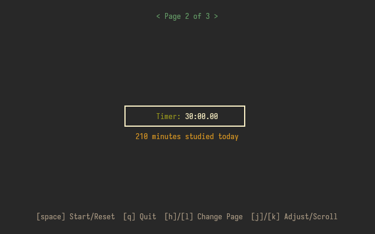
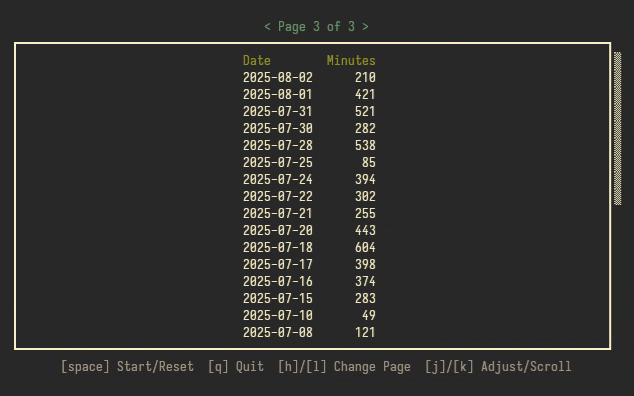

[Abandoned. See: [fokus](https://sr.ht/~fijarom/fokus/) for maintained rewrite in Rust.]

# stutui
A minimalist terminal‐based study timer and stopwatch with daily logging, built in C
[](#) [](./COPYING) [](#) [](bitcoin:bc1qcsak5jc9p4wks34aj3t52rauusrfd6fc6m5jkz)

## Features
- Stopwatch to track elapsed time while studying.
- Countdown timer with adjustable duration.
- Daily log of minutes studied saved in a local file at `~/.config/stutui/stutui.log`.
- Interactive terminal UI with pages for stopwatch, timer, and logs.
- Vim-like control scheme.
- Distraction free minimalism.

## Screenshots






## Prerequisites
- "ncurses" development library
- C compiler (e.g., gcc, clang)
#### Debian / Ubuntu
```bash
sudo apt update
sudo apt install build-essential libncurses-dev
```
#### Fedora
```bash
sudo dnf install gcc ncurses-devel
```

## Installation
#### Arch ([AUR](https://aur.archlinux.org/packages/stutui))
```bash
paru -S stutui
# or
yay -S stutui
```
#### Manual (Other Distros)
1. Clone the repository and open it:
   ```bash
   git clone https://git.sr.ht/~fijarom/stutui
   cd stutui
   ```
2. Build the executable:
   ```bash
   gcc stutui.c -o stutui -lncurses
   ```
3. (Optional) Install system-wide:
   ```bash
   sudo install -Dm755 stutui /usr/local/bin/stutui
   ```

## Usage
Run the program:
```bash
./stutui
# or, if installed system-wide:
stutui
```
### Controls
- `[space]` : Start/Reset stopwatch or timer
- `[h]`/`[l]` : Switch pages
- `[j]`/`[k]` : Adjust timer minutes or scroll logs
- `[q]` : Quit
### Configuration
Configure stutui via the config file located at `~/.config/stutui/stutui.conf`

- `default-timer`: Default countdown timer duration in minutes (1-999). *default: 25*
- `fps`: Frames per second for UI redraw (10-60). *default: 30*

## LICENSE
This project is licensed under the terms of the GPL-3.0 license. See the [COPYING](./COPYING) file for details.

